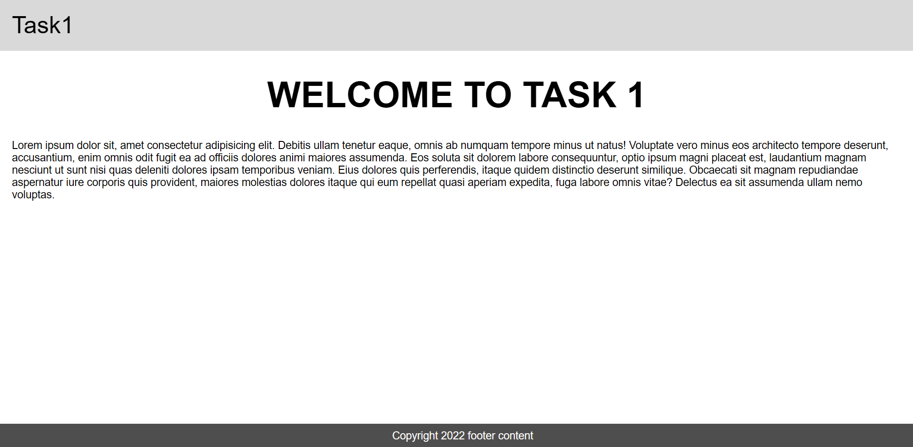

# Static Webpage Layout  

## Overview  
This project is a **single-page static website** using semantic HTML elements such as `<header>`, `<nav>`, `<main>`, and `<footer>`. It follows **a simple and clean layout** with responsive design principles.  

## Features  
- **Structured layout** using semantic HTML elements.  
- **Basic CSS styling** for typography and colors.  
- **Proper spacing** using margins and paddings for better readability.  
- **Responsive design** that adjusts for smaller screens using media queries.  

## Technologies Used  
- **HTML** for page structure  
- **CSS** for styling and layout  

## Output  

