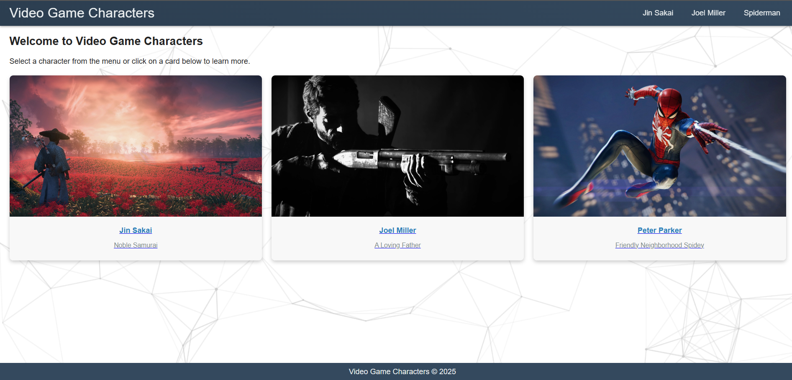

# README - Interactive Multi-Page Website Simulator with CSS Only

## Overview
This project is a CSS-only interactive multi-page website simulator featuring video game characters. It simulates navigation between “pages” without JavaScript, using the `:target` pseudo-class to show/hide sections and the `:checked` pseudo-class to toggle a mobile dropdown menu. The site is responsive, includes smooth animations, and has a stylish navbar.

## Key Features and How It Works

### 1. Multi-Section Navigation with `:target`
- **How It Works:**  
  Each content section is wrapped in a `<section>` element with a unique ID (e.g., `#home`, `#jin`, `#joel`, `#spider`). When a user clicks a navigation link, the URL fragment (hash) changes. The CSS rule using `:target` makes the targeted section visible while keeping others hidden.
  
- **Important Code:**
  ```css
  .page {
      opacity: 0;
      pointer-events: none;
      transform: translateY(20px);
      transition: opacity 0.5s ease-in-out, transform 0.5s ease-in-out;
  }
  .page:target {
      opacity: 1;
      pointer-events: auto;
      transform: translateY(0);
      animation: fadeSlideIn 0.6s ease-out;
  }
  ```
  - **Explanation:**  
    - `.page` elements start hidden (opacity 0, no pointer events) and slightly shifted down (translateY(20px)).
    - When a section is targeted via its ID in the URL, `:target` rules override these properties to display it with a smooth fade and slide effect.

### 2. Mobile Dropdown Menu with `:checked`
- **How It Works:**  
  In mobile view, a hidden checkbox (`.menu-toggle`) is used to toggle the display of the navigation menu. The associated `<label>` (hamburger icon) acts as the trigger. When the checkbox is checked, the adjacent navigation menu becomes visible.
  
- **Important Code:**
  ```css
  .menu-toggle {
      display: none;
  }
  .toggle-label {
      display: none;
      cursor: pointer;
      font-size: 2rem;
      color: #ecf0f1;
  }
  @media (max-width: 768px) {
      .toggle-label {
          display: block;
      }
      .nav-menu {
          display: none;
          flex-direction: column;
          position: absolute;
          top: 100%;
          left: 0;
          width: 100%;
          background: linear-gradient(45deg, #2c3e50, #34495e);
      }
      .menu-toggle:checked + .toggle-label + .nav-menu {
          display: flex;
      }
  }
  ```
  - **Explanation:**  
    - The `.menu-toggle` checkbox is hidden by default.
    - In mobile view (screens 768px wide or less), the hamburger menu icon (the `<label>`) is displayed.
    - The adjacent `.nav-menu` is hidden by default.
    - When the checkbox is checked (i.e., the hamburger icon is clicked), the CSS selector `.menu-toggle:checked + .toggle-label + .nav-menu` applies, setting the menu’s `display` property to `flex` so that it appears as a dropdown.

### 3. Smooth Page Transitions
- **How It Works:**  
  A keyframe animation (`fadeSlideIn`) is defined to provide a smooth fade and slide effect for sections as they become visible.
  
- **Important Code:**
  ```css
  @keyframes fadeSlideIn {
      from { opacity: 0; transform: translateY(20px); }
      to { opacity: 1; transform: translateY(0); }
  }
  ```
  - **Explanation:**  
    - This animation gradually increases opacity from 0 to 1 and moves the element from 20px below to its final position, creating a smooth transition effect.

## Screenshots
- **Home Section:**  
  
  
- **Selected Character Section:**  
  
  
- **Mobile View Dropdown:**  
  

---
