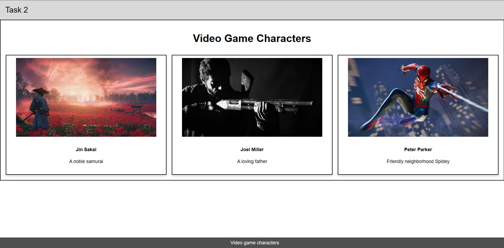

Here’s a short and clear **README** for your project:  

---

# **Grid-Based Video Game Characters Page**  

This project creates a simple **grid layout** to showcase popular video game characters. The grid is designed with **two rows**:  
- **Row 1**: A single column spanning three columns containing the title.  
- **Row 2**: Three equally spaced columns displaying character cards.  

## **Grid and Borders**  
- CSS **Grid Layout** is used to structure the page.  
- **Border properties** are applied to create visible grid lines.  
- `grid-template-columns: repeat(3, 1fr);` ensures equal column spacing.  
- `border: 2px solid black;` is used to outline elements for clarity.  

## **Output**  
Below is the final output of the project:  

  

---  
This README provides a quick overview while keeping it concise! 🚀