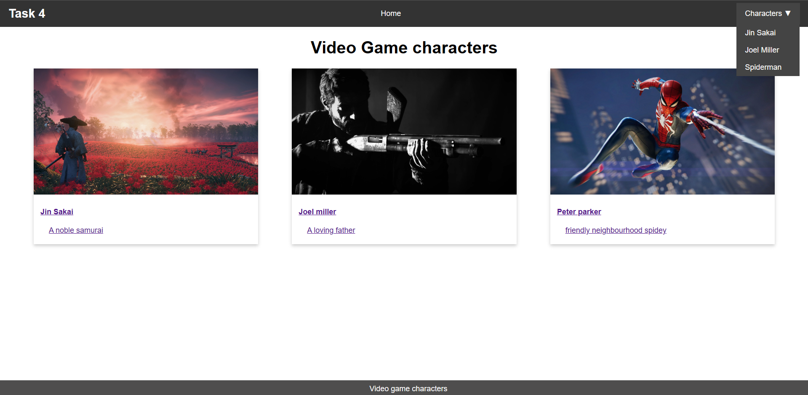

# Pure CSS Dropdown Menu  

## Overview  
This project features a **navigation bar with a dropdown submenu** created purely with HTML and CSS. The dropdown menu appears when hovering over the "Characters" option, ensuring a smooth and visually appealing user experience.  

## Features  
- **Dropdown menu using only CSS** (without JavaScript).  
- **Smooth reveal effect** using CSS `:hover` and transitions.  
- **Nested `<ul>` elements** for structured navigation.  
- **Responsive design** with a mobile-friendly fallback.  
- **Card-based layout** displaying video game characters.  

## Technologies Used  
- **HTML** for page structure.  
- **CSS** for styling, animations, and responsiveness.  

## Output  
  
