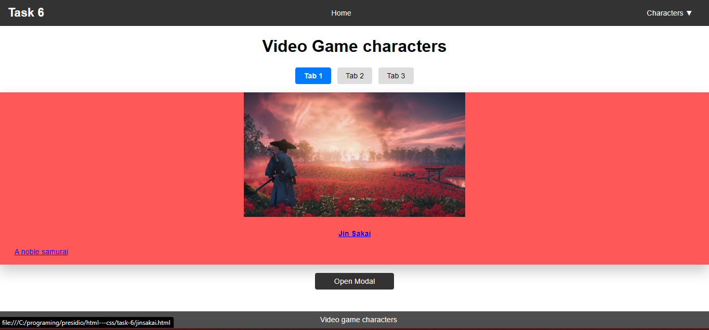

## **Modal Popup Using `:target` Pseudo-Class**  

This project demonstrates a **modal popup** using only HTML and CSS, without JavaScript. The modal is triggered with the `:target` pseudo-class.

### **Main Code for Modal**  
```css
.modal:target {
    opacity: 1;
    visibility: visible;
}
```

### **How It Works**  
- Clicking **"Open Modal"** navigates to `#modal`, making it visible.  
- Clicking **"Close"** (`href="#"`) removes focus, hiding the modal.  


