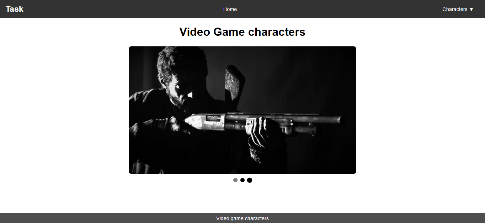

# Pure CSS Carousel  

## **Objective**  
This project implements an **image carousel** that cycles through slides both **automatically** and **manually** using **only CSS**.  

## **Output Preview**  


## **Key Code Highlights**  

### **Auto-Slide Animation (CSS @keyframes)**  
```css
@keyframes slideShow {
    0%, 30% { transform: translateX(0); }
    33.33%, 63.33% { transform: translateX(-800px); }
    66.66%, 100% { transform: translateX(-1600px); }
}
```
📌 **Pauses at each image for 5s before sliding to the next.**  

---

### **Manual Slide Selection (CSS :checked Pseudo-Class)**  
```css
#slide1:checked ~ .carousel .slides { animation: none; transform: translateX(0); }
#slide2:checked ~ .carousel .slides { animation: none; transform: translateX(-800px); }
#slide3:checked ~ .carousel .slides { animation: none; transform: translateX(-1600px); }
```
📌 **Stops auto-slide when a pagination dot is clicked.**  

---

### **Pagination Dots & Active Indicator**  
```css
.pagination label {
    width: 15px;
    height: 15px;
    background: gray;
    border-radius: 50%;
    cursor: pointer;
    transition: background 0.3s, transform 0.3s;
}

#slide1:checked ~ .pagination label[for="slide1"],
#slide2:checked ~ .pagination label[for="slide2"],
#slide3:checked ~ .pagination label[for="slide3"] {
    background: black;
}
```
📌 **Shows the active slide with a black dot.**  

---
