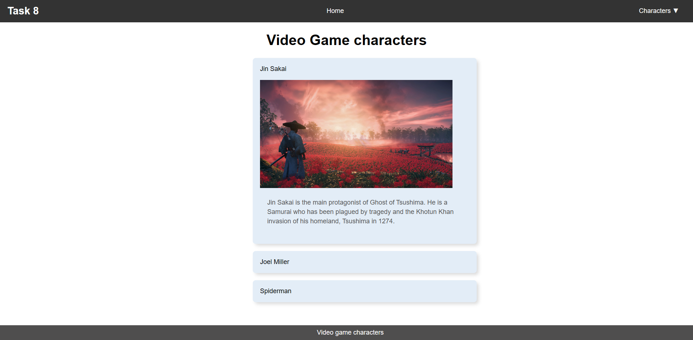

# Task 8 - Video Game Characters Webpage  

## Overview  
A simple webpage showcasing famous video game characters using an interactive **CSS accordion**.


## Main Code Snippets  
### Accordion Logic (CSS)  
```css
.accordion input[type="radio"]:checked + label + .content {
    max-height: 1000px;
    padding: 10px 10px 20px;
}
.accordion .content {
    max-height: 0;
    overflow: hidden;
    transition: max-height 0.5s, padding 0.5s;
}
```


## Screenshot  
  
