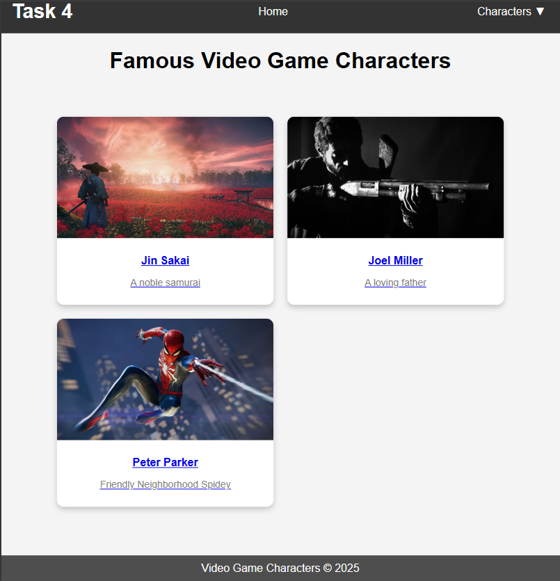

### **README - Video Game Characters Webpage**  

#### **task Overview**  
This task is a simple, responsive webpage that displays famous video game characters in a grid-based layout.


## **Code Breakdown**  

### **1️⃣ Grid Layout for Cards**  
The character cards are displayed using **CSS Grid**:  
```css
.grid-container {
    display: grid;
    grid-template-columns: repeat(auto-fit, minmax(300px, 1fr));
    gap: 20px;
    width: 80%;
    padding: 20px;
    justify-content: center;
    margin-top: 20px;
}
```
- `display: grid;` → Defines a grid container  
- `grid-template-columns: repeat(auto-fit, minmax(300px, 1fr));` → Responsive columns  
- `gap: 20px;` → Spacing between cards  

---

### **2️⃣ Flexbox for Navigation Bar**  
The navigation bar is created using **Flexbox** for alignment:  
```css
.navbar {
    background-color: #333;
    display: flex;
    align-items: center;
    justify-content: space-between;
    padding: 0 20px;
    width: 100%;
    position: sticky;
    top: 0;
    z-index: 1000;
}
```
- `display: flex;` → Aligns navbar items in a row  
- `justify-content: space-between;` → Spaces elements evenly  

---

### **3️⃣ Overlapping Elements**  
To achieve **overlapping effects**, the character names slightly overlay the images:  
```css
.container {
    position: absolute;
    bottom: 0;
    left: 50%;
    transform: translateX(-50%);
    width: 90%;
    background-color: rgba(0, 0, 0, 0.7);
    color: white;
    text-align: center;
    padding: 10px;
    z-index: 2;
}
```
- `position: absolute;` → Places text over the image  
- `transform: translateX(-50%);` → Centers the text  

---

### **4️⃣ Sticky Footer**  
The footer is fixed at the bottom of the page:  
```css
footer {
    position: fixed;
    bottom: 0;
    width: 100%;
    background: #4f4e4e;
    color: white;
    text-align: center;
    padding: 10px;
}
```
- `position: fixed;` → Keeps footer always at the bottom  

---

## **📸 Output Screenshot**  

 
